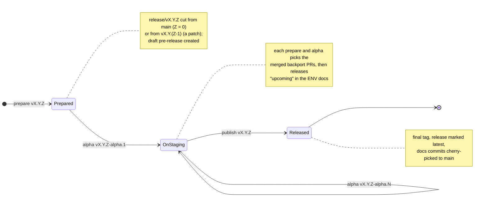

# Releasing

`main` is trunk. Every release `vX.Y.Z`, minor or patch, lives on its own branch `release/vX.Y.Z` and goes
through the same three phases, each one `pnpm release` subcommand: `prepare`, `alpha`, `publish`. What
each subcommand does is in `pnpm release --help`; this page is for choosing one, and for the label rules
the notes and the backports depend on.

## I need to…

| I need to… | Run… |
| --- | --- |
| cut the next minor | `pnpm release prepare vX.Y.0` |
| start a patch on a released line | `pnpm release prepare vX.Y.Z` (`Z > 0`; `vX.Y.(Z-1)` must be the line's latest release) |
| ship a merged PR in the release being prepared | label the PR `backport`; the next `prepare` or `alpha` picks it |
| put the release on staging | `pnpm release alpha vX.Y.Z-alpha.N` |
| fix something found on staging | PR to `main` as usual, label it `backport`, cut the next alpha |
| finalise the release | `pnpm release publish vX.Y.Z` |
| resume after a pick stopped on a conflict | resolve, `git cherry-pick --continue`, re-run the same command |
| see what a phase would do | the same command with `--dry-run` |
| preview the notes of a tag | `pnpm release notes <tag>` |
| know what a release shipped, or which release shipped a PR | the `vX.Y.Z` label on the PR: `is:pr label:vX.Y.Z` |
| check my PR before CI does | `pnpm release check-pr <number>` |

Both `prepare` and `alpha` work on your checkout: they need a clean tree and switch to the release branch.

## A release

A release branch is never merged back to `main`. Every commit on it is a `git cherry-pick -x` of a `main`
squash commit, except the docs commits `prepare` and `alpha` make, which `publish` returns to `main` the
same way. This is what lets the notes and the labels tell a backport from new work: a branch commit is
resolved to its PR through its `(cherry picked from commit …)` trailer, then the `(#N)` in its subject.

Each release keeps one GitHub pre-release from `prepare` to `publish`, re-pointed to every alpha. A line
cannot have two open at once: publish the current one before preparing the next patch.

A tag is refused, by the CLI before pushing and by CI before the image is built, when `docs/ENVS.md` or
`docs/DEPRECATED_ENVS.md` still says `upcoming`, or when its notes list a PR another release already shipped.

## Labels

Rules for PR authors, enforced by the PR check on every non-draft PR:

- The body keeps every heading of `docs/PULL_REQUEST_TEMPLATE.md` and none of its placeholder text. The
  "Environment variables" and "Minimum API version" sections are copied into the release notes as written.
- The PR carries labels of exactly one category from the table below. Several labels of one category are
  fine; labels of two categories are not. `dependencies` is only for a PR whose sole purpose is a package
  bump and never shares a PR with another category. `chore` is the catch-all.
- A PR labeled `release` is exempt from both rules.

Labels the release workflow reads or writes:

| Label | Meaning |
| --- | --- |
| `backport` | Set by hand on a merged PR: ship it in the release being prepared. The next `prepare` or `alpha` picks it. Replaced by the version label when the PR is released; a PR that was never picked keeps it. When two releases are open, the PR goes to whichever picks it first. |
| `pre-release` | Set by `pre-release.yml` on the PRs an alpha shipped and the issues they close; removed by `release.yml` at the final release. |
| `vX.Y.Z` | Set by `release.yml` on every PR the final tag shipped and the issues they close. A PR carrying any version label is never relabeled and never listed in another release's notes, so a backport appears only in the notes of the patch that shipped it. |
| `release` | A PR of the release mechanics rather than a change to ship; the PR check skips it. |

## Release-notes sections

The section a PR lands in comes from its category label. The source of truth is
`tools/release/categories.ts`; this table is checked against it by the module's spec.

| Section | Labels |
| --- | --- |
| New Features | `feature`, `enhancement`, `client feature` |
| Bug Fixes | `bug` |
| Performance Improvements | `performance` |
| Dependencies Updates | `dependencies` |
| Design Updates | `design` |
| DX & Tooling | `refactoring`, `tech`, `devops` |
| Other Changes | `chore` |

A PR with no category label, merged before the PR check existed, lands in "Other Changes". Empty sections
are left out of the notes.
